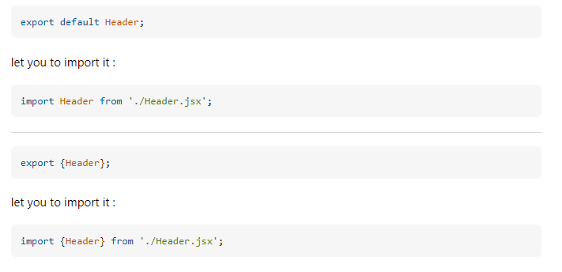

# React js Notes

# React

- React is a Javascript Library which is used to build large scale applications.

# React Dom

- React DOM is used to render react elements to the DOM.

# Why do we have two different packages React and React DOM instead one.

- React as a library consists of all core functionalities and is not specific to any environment/platform it is also used in other platforms as well apart from web like react native, react vr whereas react dom is specific to rendering react elements to the browser environment.

# NPM

- NPM is a package manager which contains many packages that we can install in our project. it's abbreavtion is not node package manager. to install packages in our project we use npm install <package_name> command

- npm init is the first command used this configures a package.json.

# Package.json

- This is a configuration of npm. npm manages all the packages and its versions in package.json. package.json keeps track of dependencies and their versions.

- ^ (caret) - used infront of package version, this allows to update the package when there are minor upgrades.
- ~ (tilda) - used infront of package version, this allows to update the package when there are major upgrades.

# Package-lock.json

- This consists of the exact versions of the versions of the dependencies and also the sub dependencies of the dependencies.
- Transitive Dependencies:- dependencies of a package and the dependencies of them and them.
- package-lock.json also contains the transisitive dependencies.

# Types of Dependencies

- There are two types of dependencies which are dev dependencies which are used only in the development phase and normal dependencies which are used in production, development etc.
  to install dev dependencies command is npm install -D package_name
  for normal dependencies command is npm install package_name

# Nodemodules

- Nodemodules consists of all the code fetched from installing the packages.
- no need to push this to git as this can regenerated using npm install command, if we have package and package.json files in git.

# NPX

- npx command is used to execute a package
- example:- npx parcel index.html

# Web bundlers

- bundlers are used to minify, compress, clean our code and make it production ready. this is done by web bundlers. examples of web bundlers are parcel, web pack, veet.

# Parcel

- Parcel creates a development build and hosts it to the local server.
- Automatically refreshing the page when there are changes made to the app (HMR).
- HMR means HOT MODULE REPLACEMENT.
- parcel is doing HMR when there are app changes.
- parcel uses a File Watching algorithm (written in c++) to implement HMR.
- uses caching for faster builds.
- It is caching in parcel-cache folder.
- parcel also does image optimization, minification, bundling, compresses the files.
- parcel also uses consistent hashing.
- parcel also does code splitting, differential bundling(parcel does different bundling based on browser type to support working in old browsers).
- does Diagnostics and does error handling
- also supports hosting in HTTPS (npx parcel index.html --https)
- also does tree shaking - remove unused code.
- creates different dev and production bundles.(for creating production build command is npx parcel build index.html)

# Scripts

- instead of using npx parcel index.html every time for creating a dev build and hosting it in localhost:1234, we can use scripts in package.json to give this command a keyword and just use npm run keyword.

- changes made in package.json for creating dev and prod builds. used start keyword for creating dev build and build keyword for prod build.
  "scripts": {
  "test": "jest",
  "start": "parcel index.html",
  "build": "parcel build index.html"
  },

- "npm run start" is similar to "npm start" we can just use npm start to run the dev build. and for creating prod build we should use "npm run build".

- Note:- only for start keyword we can ignore run keyword and just call npm start for the rest we need to use npm run keyword.

# JSX

- creating React elements using react.createElements is not developer friendly and also tedious to understand.
- Facebook developers thus created JSX to help the developer community.
- JSX is a javascript syntax to create react elements.
- JSX is not HTML in javascript.
- JSX is HTML like syntax.
- const JsxHeading = <h1 id="heading">Hey using JSX</h1>;
- This is not valid pure Javascript, Javascript engines and browsers understand ecmascript(es) syntax
- JSX code is transpiled before it reaches the javascript engine.
- transpiling means converting the code from one language to another.
- transpiling is done for converting the code that browser, js engine can understand.
- transpiling is done by parcel.
- parcel is kind of like a manager which gives this job to babel.
- JSX is a syntactic sugar for React.createElement and babel converts it to React.createElement.
- React.createElement => React Element(JS OBJECT) => HTML(render)
- JSX =>(babel transiles it to React.createElement) => React.createElement => React Element(JS OBJECT) => HTML(render)

# React Component

- Everything in React is a component
- Two ways of creating components
- Class Based Components - old way for building components, uses Javascript Classes for building components
- Functional Components - new way of building components, uses Javascript Functions for building components
- React Functional Component is just a normal javascript function that returns a React Element.
- Functional Component should start with a Capital Letter

  const HeadingComponent = () => {
  return <h1 className="heading">Hey using Functional Component</h1>;
  };
  (same as)
  const HeadingComponent = () => (
     <h1 className="heading">Hey using Functional Component</h1>;
    );

- root.render(<HeadingComponent />); this is how heading component is rendered

- Babel transpiles this functional component to react element

- component composition means composing two components in one another.
  const JsxHeading = (
    <h1 className="head" tabIndex={1}>
        Hey using JSX
    </h1>
    );

  //React Component
  const HeadingComponent = () => (
    

        <Title />
        <h1 className="heading">Hey using Functional Component</h1>
    

    );

- We can inject any piece of javascript code inside JSX using "{}"
  const HeadingComponent = () => (
    

        <Title />
        {reactElement}
        <h2>{number}</h2>
        <h1 className="heading">Hey using Functional Component</h1>
    

    );

  const Title = () => <h1>Title</h1>;
  const reactElement = <h2>React Element</h2>;
  const number = 100;

- You can also write a react element inside another react element using "{}"

      const elem = <h2>elem</h2>;
      const reactElement = (

    

      <h2>React Element</h2>
      {elem}
    

  );

- You can also use a Component inside a element
  const Title = () => (
  

  <h1>Title</h1>
  

  );
  const reactElement = (
  

  <h2>React Element</h2>
  {elem}
  <Title />
  

  );

- JSX won't blindly execute the code written inside curly braces it sanitizes the data.
- It prevents cross-site scripting.

- "<Title/>" and "<Title></Title>" both are same. also you can execute it like {Title()}
- JSX is what makes our code readable

# Props

- Props are the properties that are passed to a component.
- Similar to the arguements that are passed to a function.
- When we want to dynamically pass something to a component pass it as a prop.

# Config Driven UI

- Our website is driven by data, config.
- config driven ui means controlling your ui based on data, config.
- The data comes from apis, backend.

# Use Key attribute for the components called inside a loop

- If we aren't using key for the components inside a loop then when react re-renders all the loop elements gets re-rendered.
- using key attributes helps react to re-render only the newly added components.
- key should be unique for every component.
- using key improves performance.
- Note:- React itself says that not to use indexes as key. It is not recommended.
- A key is the only thing React uses to identify DOM elements. What happens if you push an item to the list or remove something in the middle? If the key is same as before React assumes that the DOM element represents the same component as before. But that is no longer true.
- when the list is static, not filtered, re-ordered, no ids then use indexes.
- still if you have choice avoid using indexes as much as you can.

# Why do we use React

- Everything we can implement using React can also be done using normal HTML, CSS, Javascript
- The Beauty of using a library and a framework is it makes the developers life easy, we can write less code and implement more stuff in the web page.
- React makes your coding experience very fast and then also optimizes things on webpage so that things happen very fast.

# Industry Best Practices

- Make a seperate file for every component.
- All the components should be in src folder.

# Food Ordering App

- Header Component
- -Logo
- -Nav Item
- Body Component
- - Search Component
- - Restaurant Container
- - Restaurant Card
- - Image
- - Restaurant Name
- - cuisines
- - Rating
- - Delivery Time
- Footer
- - CopyRight
- - Links
- - Address
- - Contact

# Types of export and import

- There are two types of export namely default export and named export.
- we can only have one default export for a file.
- If there are multiple thigs which we want to export in a single file we use export keyword before the variable name this is called named export.
- whenever we have a named export we use "{}" to import those.
- For a default export, no need to use curly braces for import.
- we can have both named exports and default exports in a single file.
- export default Component, import Component from "path"
- export const Component, import {Component} from "path"

# Default key in export

- There can be multiple export statements in a single file. default key can only be using once in the whole file to let you import the variable without using {} brackets.
  

# React Hooks

- React is fast in DOM manipulation, this is what react solves.
- suppose we want to make data and ui layer consistent with each other this is what react, angular and other frameworks are trying to solve.
- Hooks are normal javascript functions that are given by React that are pre-built.
- React Hooks are Normal JS utility functions written by facebook.
- useState() - SuperPowerful state variables in React.
- state variable maintains the state of the component.
- Local state variables scope is inside the component.
- useState() gives a state variable and that you can get using const [state_variable] = useState();
- the default value to the state variable is passed inside useState like useState(default_value);
- to modify the state variable we use setstate function.
- const [state, setState] = useState(default_value).
- This super powerful state variable tries to keep the UI layer in sync with data layer.
- whenever a state variable updates, React re-renders its component.
- whenever there is change in the state variable react will remove the body and quickly update the ui properly.

# Reconciliation Algorithm

- React uses Reconciliation algorithm which is also known as React fiber.
- virtual DOM is a representation of actual DOM.
- virtual DOM is an JS Object.
- Actual DOM is 

, virtual DOM is {div : {img}} somewhat like this.
- This algorithm basically tries find the difference between two virtual DOMs and updates the Actual DOM.
- Finding out difference in the HTML nodes it different and it is easy to figure out in objects.
- That's why React is faster it tries to check the previous virtual DOM and the updated DOM which are objects and updates the Actual DOM.

# Diff Algorithm

- Diff Algorithm finds the difference between two virtual DOMs.
- Finds the difference between previous and updated virtual DOMs.
- It will find the difference and does the change on every render cycle.

# Monolith Architecture

- The whole project is build as a single app.
- APIs, UI pages, Authentication code and databases connection code, sms code etc everything written in the same sevice.
- Even if we want to make a change in any one of the service we need to compile and build the whole project.

# Microservice Architecture

- The app is broken down into multiple independent services.
- This helps for scaling each services and also not having a single point of failures and also we can use different techstacks for different services like ui written in reactjs and backend written in java.
- seperate projects for every service.
- different service deploy at different ports and all can be mapped to domain names.
- like abc.com/ui for ui and abc.com/api for backend etc.
- ui can interact with backend using /api url.

# useEffect React Hook

- it has two arguements they are callback function and a dependency array.
- when nothing is passed in the dependency array the callback function will be invoked after the component gets rendered.

# Shimmer ui

- A fake page or card is shown untill the data is loaded.

# Conditional Rendering

- rendering based on condition is called conditional rendering.

# Rendering a component means similar to calling a function but with updated values

# whenever state variables update, react triggers a reconciliation cycle(re-render the component)

# If there is no dependency array in useEffect then useEffect gets called on every render.

# If the dependency array is empty then useEffect is called on initial render(just once)

# If there is some dependencies in the array then useEFFECT is called when the dependencies changes.

# Never call useState hooks outside the component, useState is used to create local state variables for functional components.

# Always create useState variable at the beginnings of the component.

# Never create useState variables inside a if-else condition, for loop, some function create them at top of the functional component.

# Routing

- used react-router-dom package for creating routes.
- createBrowserRouter creates the configuration for the routes it is an array of the routes.
  const appRouter = createBrowserRouter([
  {
  path: "/",
  element: <AppLayout />,
  },
  {
  path: "/about",
  element: <About />,
  },
  ]);

- Router provider is a component used to render the routes.
- root.render(<RouterProvider router={appRouter} />);
- Function starting with "use" keyword is generally a hook, common convention used in react industry.
- children routes - if we want to have a certain component based on the routes.
- outlet is the component that gets replaced with the children component based on path.

const AppLayout = () => (

  

    <Header />
    <Outlet />
  

);

const appRouter = createBrowserRouter([
{
path: "/",
element: <AppLayout />,
children: [
{
path: "/",
element: <Body />,
},
{
path: "/about",
element: <About />,
},
{
path: "/contact",
element: <Contact />,
},
],
errorElement: <Error />,
},
]);

- Note:- Never use anchor tags for routes in react as it reloads the whole page.
- use Link Component provided by reacct router dom.
- <Link to="/">Home</Link>
- using link it just changes the component based on routes
- Link is a wrapper over anchor tag, it is a special type of anchor tag provided by react router dom

# Two types of routing in web apps

- Client Side Routing:- All the components code is already present and when clicked on any route we just load those components.
- Server Side Routing:- when clicked on a route, the page gets reloaded and a network call is made to that route and fetches those route component and showcases that page.

- React is used to create single page application using client side routing.

# Class Based Components

- This is a normal javascript class.
- class UserClass extends React.Component {

}; " extends React.Component" is what makes the UserClass a class based component

- class based component has a render method that returns a piece of jsx or react element.

- super keyword is used to call the constructor of the parent or access the properties or methods of a parent(super class)

- when we are extending a class(parent is super class, child is derived class) we need to call super before accessing the this keyword or returning from derived contructor

- we need to call super method in the constructor method to use this keyword to access the props.

- import React from "react";
  class UserClass extends React.Component {
  constructor(props) {
  super(props);
  }
  render() {
  return (
  

  <h2>Name: {this.props.name}</h2>
  <h3>Location: Bengaluru,Karnataka</h3>
  <h4>Contact: pavankarthikparichuri2001@gmail.com</h4>
  

  );
  }
  }

export default UserClass;

- rendering a functional component is same as invoking the functional component and for class based components it is creating an instance of the class.

- whenever a class based component is called first the constructor is called after that render is called.

# LifeCycles of React components

- componentdidmount gets called once the component gets completely mounted or rendered.
- similar to useEffect(()=>{callbackfunc()},[]).

- there are two phases in react one is render phase where constructor and render is called and commit phase where DOM updates, side effects are ran like componentdidmount, componentdidupdate,componentwillunmount.

- when there are multiple children components to a component react batches the render phases of this child components and post that the commit phase is batched together and gets completed.

- React is doing the batching at render phase because once the components enter commit phase DOM manipulation happens which is an expensive operation in loading a component.

- In the render phase, the constructor is called and the render method is called which does the re-conciliation(checking the diff between two virtual DOMs) and in commit phase the actual DOM manipulation happens.

- componentDidUpdate event is called when there is a change in some state.

- componentwillunmount event is called just before component unmounting

- unmounting means when the component goes from the HTML/UI.

- componentwillupdate gets called in everyrender.
- also useeffect when nodependendecy array is passed gets called in every render.useEffect(()=>{callbackfunc()}).
- useEffect(()=> {}, [count]) this gets called when there is change in the count state.
- componentDidUpdate(prevProps, prevState){if(prevState.count!==this.state.count)console.log("count changed")}
- componentWillUnmount can be replicated with useEffect using a return function.
- useEffect(()=> {return()=>{}},[])
- componentWillUnmount for cleanup.

# Single Responsibility Principle

- In computer science there is a principle called single responsibility principle where every function or a class or a identity should be having a single responsibility.

- modularity meaning breaking your code into small meaningful modules that helps in making the code maintainable and testable and also reusable.

# Custom Hooks

- we can create own hooks and make code modular.
- created few custom hooks in utility folder.

# Chunking/Code Splitting/Dynamic loading/ Lazy Loading/ on Demand Loading/ Dynamic import

- bundler creates a single js file after bundling but when the app is so huge then the size of this file can blowup.
- we can logically bundle or break our app into multiple files like one bundle for uber eats and one bundle for uber cabs.
- what we will be loading the code only when user goes to that page(on demand loading).
- react provides a named export called lazy using which we can achieve this on demand loading.
- lazy function takes a callback function of import function which takes path of the component that needs to be lazy loaded.
- const Grocery = lazy(() => import("./components/Grocery"));
- react is fast and loads the component as soon as we click on grocery screen but the grocery screen is lazy loaded and till that time the code is not present in the browser. so this may cause error which can fixed by wrapping the grocery component with suspense component which has a fallback prop that tells what to load till the grocery component is lazy loaded.

# styling

- scss and sass is writing css with some super powers.
- css, scss, sass these is not recommended a way to write css these donot scale well with larger applications.
- styled components are another way to write styling.
- another way is by using libraries like material ui, bootstrap and chakra ui, ant design these provide already styled components
- There is another trending framework called tailwind.css.
- npm install -D tailwindcss postcss, postcss is used by tailwindcss behind the scenes. postcss is a tool that transforms css along with javascript. to transform css inside javascript tailwindcss uses postcss.
- tailwindcss gives you classNames automatically to apply the css to the components.
- tailwindcss is very lightweight, when parcel bundles the css only the used tailwindcss in the file is added instead of all the taildwind css files. only the used css is bundled
